---

## 🧑‍💻 About me

- 💼 **Full-Stack Developer & IT Administrator** at OSF Broker de Seguros (2024 – present). I build and deploy **sistemaSeguros**, the internal platform for clients, policies, payments and users.
- 📡 **Network & Broadcast Technician** at BeloSport (2022 – present): fiber optics, point-to-point wireless links and live TV cameras. That mix is where **Overlay Racing** came from.
- 🎓 Studying **Computer Engineering** at UADE.
- 🤖 Interested in **AI applied to real products**: LLM integrations, computer vision and automation.
- 🧱 I care about clean code, SOLID principles and design patterns.

## 🛠️ Tech stack

   
   
   
  

  
  
  
  
  
  
  
  
  

## 🚀 Featured projects

<table>
<tr>
<td width="50%" valign="top">

### 🏁 [Overlay Racing](https://github.com/IamRoman-rb/overlay-racing)
Live broadcast overlay software for motorsport TV, used in real productions. Controls on-screen graphics, timing, **audience voting by QR** and a **stewards' penalty panel**, all synced in real time. Per-machine licensing and a customer dashboard.

`Electron` `React` `Vite` `Node.js` `Express` `Socket.IO` `SQLite` `NGINX` `PM2` `vMix / OBS`

</td>
<td width="50%" valign="top">

### 🛡️ [sistemaSeguros](https://github.com/IamRoman-rb/sistemaSeguros)
Internal platform for an insurance brokerage: clients, policies, payments and user management. Built end to end and deployed with continuous delivery; in daily use by the team.

`Node.js` `JavaScript` `REST` `Linux` `Cloud deployment`

</td>
</tr>
<tr>
<td width="50%" valign="top">

### 💄 [MakeUp AR](https://github.com/IamRoman-rb/makeup_ar)
Mobile **augmented-reality makeup try-on** app. Face-mesh detection, AI-generated color recipes from an LLM, and a swappable renderer interface (Clean Architecture) built to run on mid-range Android phones.

`Flutter` `Dart` `ML Kit` `LLM API` `Firebase`

</td>
<td width="50%" valign="top">

### 🌐 [web-seguros](https://github.com/IamRoman-rb/web-seguros)
Landing page with a private admin panel for an insurance organization. Staff manage events and edit site content without touching code; JWT-secured accounts.

`React` `Vite` `Tailwind` `Node.js` `Express` `JWT`

</td>
</tr>
<tr>
<td colspan="2" valign="top">

### 🤖 [JARVIS-OS](https://github.com/IamRoman-rb/jarvis-os) &nbsp;`🚧 in progress`
Linux-based operating system with a built-in AI assistant: talk to it by text or voice and it executes tasks on the system, while still working as a normal OS. Includes automatic directory sync across machines.

`Linux` `AI assistant` `Automation`

</td>
</tr>
</table>

## 📊 Live GitHub activity

  
  

  

  

  <picture>
    <source media="(prefers-color-scheme: dark)" srcset="https://raw.githubusercontent.com/IamRoman-rb/IamRoman-rb/output/github-snake-dark.svg" />
    
  </picture>

## 🎓 Education & certifications

- **Computer Engineering** — UADE (2022 – present)
- **Cybersecurity Fundamentals** — IBM SkillsBuild (2026)
- **Python Essentials 1 & 2** — Cisco Networking Academy (2024)
- **Full-Stack Developer Node.js** — Digital House (2021)

---

<i>🇦🇷 Buenos Aires, Argentina · Spanish (native) · English (B1) · Always building something.</i>

